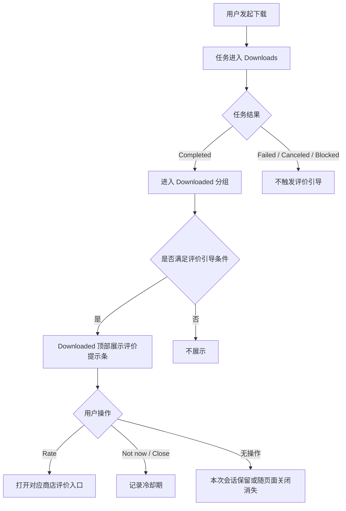

# [StreamFab 浏览器插件] 商店评价引导需求

## 文档信息

| 项目 | 内容 |
| --- | --- |
| 文档类型 | 需求文档 |
| 试点插件 | StreamFab Video Downloader for Browser |
| 适用渠道 | Chrome Web Store 版本、Edge Addon 版本 |
| 当前版本 | v0.1 |
| 日期 | 2026-05-29 |
| 目标读者 | 产品、设计、客户端开发、测试 |

## 1. 背景与目标

Chrome 插件矩阵分析显示，当前多个插件存在评分资产不足的问题。Video 插件是通用多站点下载器，也是 ytdlp_mode 的基线样例，已上线且具备较明确的用户规模基础。因此，评价引导先在 Video 插件中试点，不全量铺到所有插件。

Video 插件的核心价值链路是：用户检测到可下载视频，发起下载，并在 Downloads / Downloaded 区域看到任务成功完成。评价引导应放在用户完成核心价值闭环之后，而不是安装后、检测后或下载开始时。

本需求目标：

1. 提升 Chrome Web Store / Edge Addon 的有效评分与评论数量。
2. 在不打断下载任务流的前提下，引导已经完成核心价值体验的用户进行评价。
3. 验证“下载完成后评价引导”是否适合作为浏览器插件产品线的通用口碑建设机制。

本期不做：

| 不做项 | 原因 |
| --- | --- |
| 不做奖励换评价 | Chrome Web Store 政策禁止通过激励方式操纵评分、评论或安装量 |
| 不要求 5 星评价 | 避免评分操纵和误导用户 |
| 不在失败场景触发 | 下载失败、CoApp 异常、配额阻断等场景不适合引导评价 |
| 不在单条下载记录右侧新增 icon | 会破坏 Downloaded item 的文件操作语义 |
| 不做全插件同步上线 | 先通过 Video 试点验证效果和干扰程度 |

## 2. 相关文档

| 文档 | 关联内容 |
| --- | --- |
| [Chrome 插件矩阵分析](https://doc-viewer.specm8.work/s/dga9nnue) | 插件评分资产现状与试点优先级 |
| `Extension/streamfab_video_downloader_for_browser/README.md` | Video 插件支持 Popup + Sidebar 双模式 |
| `Extension/streamfab_video_downloader_for_browser/plugin_differences.md` | Video 是 ytdlp_mode 活样例，主结构为 Detected / Downloads |
| `Extension/_common/10_detection_modes.md` | 任务状态包含 Pending、Downloading、Completed、Failed、Canceled；Completed 后进入 Downloaded 分组 |
| `Extension/_common/11_user_flows_and_error_handling.md` | 下载成功后进入 Completed / Downloaded，并给出下载完成反馈 |
| `Extension/_common/12_ui_ux_visual_layout_specs.md` | Downloads 页负责查看和管理下载任务，状态反馈应清楚区分成功、失败和等待 |
| `chrome_store_plugin_matrix_analysis_report.md` | 当前插件矩阵评分资产不足，Ytdlp / Video 是核心活跃资产 |

## 3. 需求概述

在用户首次成功下载后，在 `Downloaded` 分组顶部展示一次轻量评价提示条。提示条位于 `Downloaded (n)` 标题下方、第一条下载记录上方，不进入单条下载记录的 hover action 区。

该提示条属于插件级反馈入口，而不是文件级操作。它应保持低高度、可关闭、低频率，并且只在成功体验后出现。

推荐位置：

| 位置 | 结论 | 原因 |
| --- | --- | --- |
| Downloaded 分组标题下方 | 推荐 | 不破坏单条记录操作语义，且与下载完成结果相关 |
| 单条下载记录右侧 | 不推荐 | 与 Open Folder / Close 混在一起，会被理解为文件级操作 |
| Downloaded 标题右侧垃圾桶附近 | 不推荐 | 垃圾桶是列表清理语义，评价入口放在这里不自然 |
| 下载完成系统通知 | 不推荐 | 侵入感较强，不适合承载商店评价动作 |
| 全局 modal 弹窗 | 不推荐 | 打断用户继续下载或打开文件 |
| Dashboard / Setting 底部 | 可作为长期入口 | 适合提供常驻反馈入口，但不适合作为首次主动引导主入口 |

## 4. 用户流程

本需求涉及下载完成后的提示展示、用户点击、关闭和抑制分支，因此需要补充用户流程。

## 5. 触发逻辑

### 5.1 触发条件

评价引导必须同时满足以下条件：

| 条件 | 规则 |
| --- | --- |
| 渠道 | Chrome Web Store、Edge Addon |
| 任务状态 | 至少 1 个任务进入 `Completed` |
| 成功类型 | 文件写入成功且校验通过 |
| 用户状态 | 用户未主动点击过 `Rate` |
| 冷却状态 | 用户未处于关闭后的冷却期 |
| 展示位置 | 用户当前可见或进入 `Downloaded` 分组 |

### 5.2 不触发条件

以下场景不得触发评价引导：

| 场景 | 原因 |
| --- | --- |
| 下载失败 | 用户处于负面体验，不适合引导商店评价 |
| 用户取消下载 | 未完成核心价值闭环 |
| CoApp 未连接或更新失败 | 问题尚未解决，优先给出修复引导 |
| 配额耗尽或订阅过期 | 用户处于权益阻断场景 |
| DRM / YouTube Chrome 限制 | 产品能力边界明确，不适合引导评价 |
| 当前正在 hover 下载记录 | 避免与 `Open Folder` / `Close` 操作竞争注意力 |
| 批量任务中仅部分完成 | 等待批量任务结束后按一次成功体验处理 |

### 5.3 频控规则

| 用户操作 | 后续规则 |
| --- | --- |
| 点击 `Rate` | 永久不再主动展示评价提示 |
| 点击关闭或 `Not now` | 14 天内不再展示 |
| 无操作关闭插件 | 下次满足条件时可继续展示，但同一自然日最多展示 1 次 |
| 完成批量下载 | 只计为 1 次成功体验，不按文件数量重复触发 |

## 6. 需求说明

### 6.1 Downloaded 分组顶部提示条

| 原型 / 截图 | 说明 |
| --- | --- |
| 待补充原型截图：Downloaded 分组顶部展示标准提示条 | 在 `Downloaded (n)` 标题下方、第一条下载记录上方增加评价提示条。提示条不改变下载记录 item 的结构，不占用 item 右侧 hover action，不影响 `Open Folder` 和关闭 / 删除操作。 |

提示条布局规则：

| 元素 | 规则 |
| --- | --- |
| 高度 | 标准态 32-36px；紧凑态不超过 28px |
| 位置 | Downloaded 标题下方，第一条记录上方 |
| 文案 | 一行展示，超出省略 |
| 操作 | `Rate` 作为文字按钮；关闭按钮使用现有 close 样式 |
| 样式 | 低强调，不使用强弹窗、不使用动画抢注意力 |

当前 Downloaded 列表右侧 hover action 已承载文件级操作：`Open Folder` 和关闭 / 删除。评价入口不放在单条记录右侧，避免用户把它理解为文件级操作。

### 6.2 低空间兜底

| 原型 / 截图 | 说明 |
| --- | --- |
| 待补充原型截图：Popup 空间不足时的紧凑提示条 | 当 Popup 高度不足时，提示条允许采用紧凑形态；如果当前 Downloads 列表空间不足或用户正在 hover item，则延后到用户下次进入 Downloads / Downloaded 时展示。 |

兜底形态：

| 形态 | 使用条件 | 展示内容 |
| --- | --- | --- |
| 标准提示条 | Sidebar 或 Popup 空间充足 | 一行文案 + `Rate` + `Not now` / 关闭 |
| 紧凑提示条 | Popup 空间有限 | `Enjoying StreamFab?` + `Rate` + 关闭 |
| 延后展示 | 当前 Downloads 列表空间不足或用户正在 hover item | 用户下次进入 Downloads / Downloaded 时再展示 |

不允许把紧凑形态降级为单条 item 上的独立 icon。

### 6.3 文案

推荐文案使用中性表达，不引导用户给好评。

| 场景 | 文案 | 按钮 |
| --- | --- | --- |
| 标准态 | `Download completed. Share your feedback?` | `Rate` / `Not now` |
| 紧凑态 | `Enjoying StreamFab?` | `Rate` / close |
| Tooltip | `Rate StreamFab Video Downloader on Chrome Web Store` | - |

### 6.4 评价链接

| 渠道 | 链接 |
| --- | --- |
| Chrome Web Store | [StreamFab Video Downloader](https://chromewebstore.google.com/detail/streamfab-video-downloade/pmblmkemjdeicgahfkiogdkhjhefhhea?hl=en-US&utm_source=ext_sidebar) |
| Edge Addon | [StreamFab Video Downloader - Microsoft Edge Addons](https://microsoftedge.microsoft.com/addons/detail/streamfab-video-downloade/bgfbcbkjjndjeamckkakgkiphdhlmbip) |

### 6.5 对既有界面的影响

| 模块 | 影响 |
| --- | --- |
| Detected | 无影响，不新增入口 |
| Downloads / Downloading | 无影响，不在下载中任务上展示 |
| Downloaded | 新增分组级提示条，不修改单条 item hover action |
| Popup | 支持紧凑提示条或延后展示 |
| Sidebar | 支持标准提示条 |
| Dashboard / Setting | 可增加常驻 `Rate on Chrome Web Store` 入口，作为后续扩展，不属于本期主动引导 |

## 7. 数据上报

### 7.1 本地状态

客户端需记录以下本地状态，用于频控和避免重复打扰：

| 字段 | 含义 |
| --- | --- |
| `rating_prompt_eligible` | 是否已完成首次成功下载，具备展示资格 |
| `rating_prompt_last_shown_at` | 上次展示时间 |
| `rating_prompt_dismissed_at` | 用户关闭或 Not now 时间 |
| `rating_prompt_rated_at` | 用户点击 Rate 时间 |
| `rating_prompt_show_count` | 累计展示次数 |

### 7.2 事件上报

| Event | Trigger | Params |
| --- | --- | --- |
| `rating_prompt_eligible` | 首个任务进入 Completed | `channel`、`task_type`、`is_batch` |
| `rating_prompt_show` | 提示条展示 | `surface`、`layout`、`download_count` |
| `rating_prompt_click_rate` | 点击 Rate | `surface`、`layout`、`days_since_install` |
| `rating_prompt_dismiss` | 点击关闭或 Not now | `surface`、`reason` |
| `rating_prompt_suppressed` | 满足下载完成但未展示 | `reason`、`channel` |

## 8. 合规与策略边界

Chrome Web Store 政策要求开发者不得通过非法或激励方式操纵评分、评论或安装量，也不得使用误导性内容影响用户判断。评价引导必须遵守以下规则：

| 规则 | 要求 |
| --- | --- |
| 不激励 | 不提供折扣、权益、下载次数、功能解锁等奖励 |
| 不诱导五星 | 不出现“5 stars”“good review”等定向表达 |
| 不阻断任务 | 不用 modal 阻断用户继续使用 |
| 不筛选正负反馈 | 不根据用户选择好评/差评决定是否跳商店 |
| 不伪装成系统通知 | 不使用系统级警告或误导式 UI |
| 不夸大商店表现 | 不使用“官方推荐”“排名第一”等无依据表达 |

参考来源：Chrome Web Store Program Policies 对评分 / 评论操纵、误导性行为、通知滥用和扩展质量均有明确限制。

## 9. 待确认事项

1. Chrome Web Store 评价页是否有稳定的 review 深链，还是只能跳转到插件详情页。
2. 14 天冷却期是否需要与其他营销提示共享频控池。
3. Dashboard / Setting 是否需要同步增加常驻评价入口，作为本期还是后续需求。
