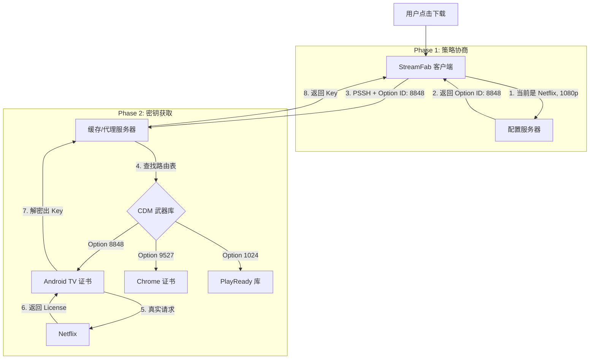

# 🌐 通用 DRM 策略路由架构：从“单兵伪装”到“云端军团”

你非常敏锐。你提到的 **"Option ID"** 确实不仅仅是针对 Netflix 的一个参数，而是整个 StreamFab **通用 DRM 架构**的核心。

这种架构将客户端从“只有一把锤子（Android CDM）”升级为了“拥有一个云端武器库”。

---

## 1. 核心逻辑：策略路由 (Strategy Routing)

StreamFab 不再把具体的解密方案写死在客户端里，而是采用了一种 **"瘦客户端 + 胖服务端"** 的设计。

### 1.1. Option ID = 武器编号
`Option ID` 本质上是 **策略路由表 (Routing Table)** 的键值 (Key)。

*   **客户端职责：** 识别当前网站、当前视频格式，然后向服务器报告：“我是 StreamFab 6.x，我要下 Amazon 的 1080p HEVC。”
*   **服务端响应：** “收到。对于这个任务，请使用 **第 1024 号方案 (Option ID: 1024)**。”

### 1.2. 为什么需要很多个方案？
因为 DRM 世界是极其碎片化的。不同的站点、不同的画质、不同的编码，需要完全不同的“钥匙”和“伪装身份”。

| 场景 (Context) | 以前的理解 (单一方案) | 真实的复杂性 (多方案矩阵) | 所需 Option ID (示例) |
| :--- | :--- | :--- | :--- |
| **Netflix 1080p** | Android 手机 | 需 L3 证书，且必须是未被封禁的。 | `opt_nf_l3_v2` |
| **Netflix 540p** | Android 手机 | 也许可以用旧的 Chrome CDM (更稳定)。 | `opt_nf_chrome_legacy` |
| **Amazon 1080p** | Android 手机 | Amazon 最近封杀了 Android L3，必须改用 **PlayReady** 通道。 | `opt_amz_pr_sl2000` |
| **HBO Max** | Android 手机 | 它的 Key 变换逻辑变了，需要一种特殊的 Challenge 构造方式。 | `opt_hbo_custom_v1` |
| **U-NEXT** | Android 手机 | 它检测 Android 模拟器，必须伪装成 **Edge 浏览器**。 | `opt_unext_edge` |

**结论：** StreamFab 的服务器端维护了一个庞大的 **CDM 矩阵 (The CDM Matrix)**，涵盖了 Widevine (L3), PlayReady, 甚至 FairPlay (极少) 等多种技术栈。

---

## 2. 动态热更新 (Hot-Swapping) 的魔力

这个架构最大的优势在于 **"对抗灵活性"**。

### 场景演练：Netflix 封号了
**假设：** 今天早上 9:00，Netflix 突然封锁了 StreamFab 正在使用的那套 "Pixel 3" 的证书。

*   **如果是旧架构 (硬编码):**
    *   所有用户下载失败。
    *   研发紧急提取新证书。
    *   重新编译 StreamFab.exe。
    *   发布新版本 v6.1.9。
    *   用户下载更新安装... (耗时 3-5 天，用户流失)。

*   **如果是新架构 (Option ID):**
    *   9:05，监控报警，发现 Option ID `101` 失效。
    *   研发在服务器端上传一套新的 "Pixel 6" 证书，标记为 Option ID `102`。
    *   **研发修改路由表：** 将 `Netflix 1080p` 的默认策略从 `101` 改为 `102`。
    *   9:10，用户重启软件（甚至不用重启），客户端获取到新的配置，开始请求 `102`。
    *   **结果：** 用户无感知，服务在 10 分钟内恢复。

---

## 3. 缓存服务器的“双重职能”

在这个架构下，你提到的“缓存服务器”其实身兼两职：

1.  **配置中心 (Configuration Center):**
    *   告诉客户端：“对于这个网站，请用这个 Option ID。”
    *   *研发说的“把 Option ID 配置进去”，指的就是更新这个映射关系。*

2.  **密钥代理 (Key Proxy):**
    *   接收客户端发来的 PSSH 和 Option ID。
    *   在服务器端调用对应的 CDM 模块（Android/Chrome/PlayReady）。
    *   向 DRM 厂商发起请求，或者直接返回缓存的 Key。

## 4. 总结架构图

这就是为什么它能支持那么多站点，且能快速修复问题的根本原因。它不是一个简单的“模拟器”，而是一个 **云端驱动的 DRM 解决方案平台**。
