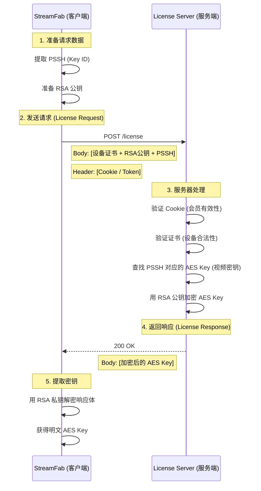

## 1. 核心定义：License Request 到底是什么？
简单来说，这就是一次 **“骗取信任”的交易**。
**StreamFab (客户端)** 对 **License Server (服务端)** 说：
> "你好，我是一台合法的 Android 手机（出示身份证）。我想播放这个视频（出示票据），请把解密密码给我。"

### 1.1. 它是如何伪造的？(The Masquerade)
并不是只要改个 User-Agent 就能伪装的。DRM 的伪装必须深入到 **密码学层面**。
StreamFab 必须构建一个符合 Google Widevine 协议标准的二进制数据包（Protobuf 格式），这个包里包含了“偷来”的真实安卓设备的身份信息。

---

## 2. 请求载荷解剖 (Payload Anatomy)
当 StreamFab 发起 `POST` 请求时，它的 Body 里发送了一串看似乱码的二进制流。如果我们把它拆解开，里面主要包含这三样东西：

### 🧱 组件 A：设备身份证 (Device Certificate)
*   **来源：** StreamFab 内置（从真实 Android 手机提取）。
*   **作用：** 证明“我是一台受信任的设备，我有资格播放加密内容”。
*   **关键点：** 这个证书是被 Google 签名的。如果证书被列入黑名单（Revoked），请求会被拒绝。

### 🔒 组件 B：公钥 (Device Public Key)
*   **来源：** StreamFab 内置（与身份证配对）。
*   **作用：** **用于加密传输。**
*   **原理：** 这是一个 RSA 公钥。服务器用它加密 Content Key，确保只有持有对应私钥的 StreamFab 才能解密读取。

### 🎫 组件 C：PSSH 数据 (Protection System Specific Header)
*   **来源：** 视频的 Manifest (MPD/M3U8) 文件。
*   **作用：** **“我要申请哪部电影的哪把锁？”**
*   **内容：** 包含了视频的唯一 ID (Key ID)。服务器根据这个 ID 去数据库查找对应的 Content Key。

---

## 3. 交互流程 (The Handshake)


## 4. 为什么无登录态会失败？
看上面的 **步骤 3 (服务器验证)**。
License Server 在处理请求时，**不仅**校验设备证书（DRM 层面），**还会**校验 HTTP 请求头里的 `Cookie` 或 `Authorization Token`（业务层面）。
*   如果你的 Cookie 过期或不存在，服务器根本不会走到“查钥匙”那一步，直接在门口就把你拦住了：`401 Unauthorized` 或 `403 Forbidden`。
*   这就是为什么“待下载”任务（需要跑这整个流程）在退出登录后无法启动。

当代码发起“获取钥匙”的动作时，实际上是发送了一个标准的 HTTP POST 请求。这个过程遵循 **Widevine EME (Encrypted Media Extensions)** 协议。

## 1. 请求解剖 (The Anatomy of the Request)

### 请求地址 (URL)
这个地址通常隐藏在 MPD Manifest 里，或者硬编码在 JS 播放器中。
*   **Netflix 示例:** `https://www.netflix.com/api/shakti/license/widevine`
*   **Generic 示例:** `https://license.service.com/get_license`

### 请求体 (Payload) - 核心中的核心
这是一个二进制的 **Protocol Buffer** 数据块（通常是 base64 编码的）。它不是明文 JSON，而是加密的。
*   **内容:**
    1.  **Device Certificate (设备证书):** 证明我是合法的 Widevine L3 设备（这就是为什么 StreamFab 需要模拟 CDM）。
    2.  **Session ID:** 本次播放会话的唯一 ID。
    3.  **PSSH (Protection System Specific Header):** 从 MPD 里拿到的那个“锁孔信标”。
    4.  **Key ID:** 我想要哪把钥匙？
*   **含义:** “我是合法的播放器 X，这是我的证书。我想申请视频 Y 的钥匙，这是我的请求签名。”

### 请求头 (Headers) - 鉴权的关键
这是服务端决定“给不给你钥匙”的依据。
```http
POST /license/widevine HTTP/1.1
Host: www.netflix.com
Content-Type: application/octet-stream
# 👇 最重要的一行：身份证明
Cookie: NetflixId=v%3D2%26ct%3D...; SecureNetflixId=...; 
# 👇 防伪证明
User-Agent: Mozilla/5.0 (Windows NT 10.0; Win64; x64) ...
Origin: https://www.netflix.com
Referer: https://www.netflix.com/watch/12345
```

---

## 2. 代码层面的动作 (Pseudo Code)

在 Python 或 C++ (Chromium) 层面，这个过程大概是这样的：

```python
def acquire_license(pssh, auth_token):
    # 1. 初始化 CDM (模拟真实设备)
    cdm = WidevineCDM(device_cert="device_private_key.pem")
    session_id = cdm.open_session(pssh)
    
    # 2. 生成 Challenge (挑战书)
    # 这就是那段加密的二进制数据
    challenge = cdm.get_license_challenge(session_id)
    
    # 3. 发送 HTTP 请求 (去敲门)
    response = requests.post(
        url="https://netflix.com/license",
        data=challenge,  # 带着挑战书
        headers={
            "Cookie": auth_token,  # 👈 如果这里是空的，直接 403
            "User-Agent": "Chrome/120.0..."
        }
    )
    
    if response.status_code != 200:
        raise Exception("License Request Failed! Logged out?")
        
    # 4. 解析 Response (拿钥匙)
    # 服务端返回的也是加密的二进制
    license_message = response.content
    
    # 5. CDM 解密钥匙
    # 只有刚才生成 Challenge 的那个 CDM 才能解开这个包
    keys = cdm.parse_license(session_id, license_message)
    
    return keys # -> [{"kid": "ab12...", "key": "12ef..."}]
```

## 3. 为什么 Logout 会挂？
看上面代码的 **Step 3**。
如果用户 Logout 了，浏览器的 Cookie 存储就被清空了（或者 Session Token 在服务端被标记为 Invalid）。
当你带着空的或者过期的 Cookie 去 POST License Server 时，服务器甚至不会看你的 Challenge 内容，直接在网关层就给你拒之门外：
`HTTP/1.1 403 Forbidden` 或 `401 Unauthorized`。
