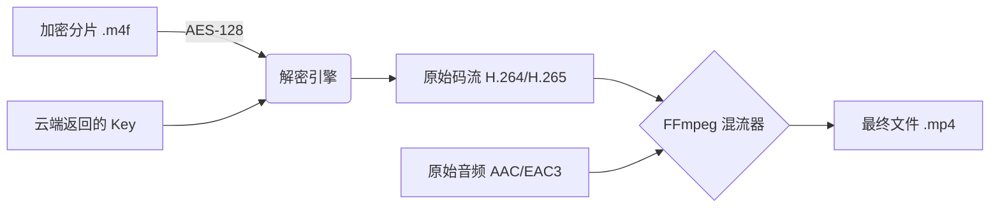
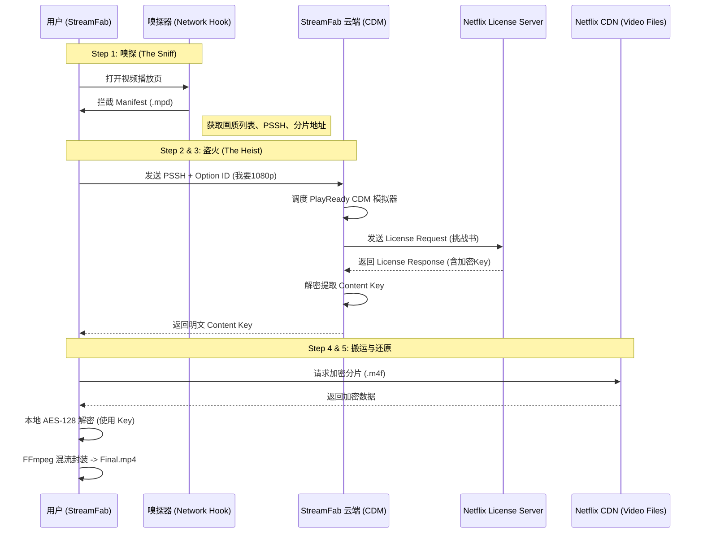
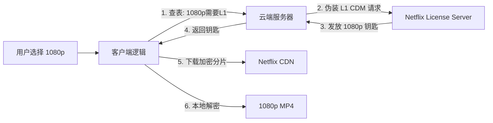
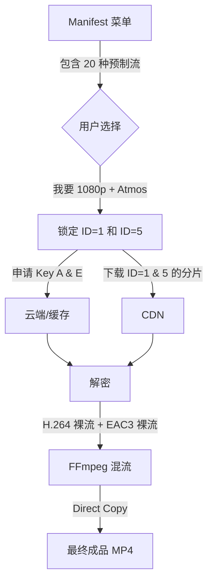
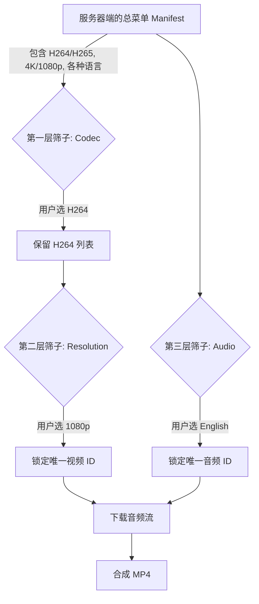

# 🚀 我的 DRM 认知进化之路 (My Learning Curve)

这是一份非常珍贵的思维快照。你从最初的“直觉假设”，一步步深入到了“系统架构”的内核。
这三个阶段完美对应了 DRM 攻防技术的演进史。

---

## 📅 Phase 1: 直觉假设期 (The Naive Proxy)
> **"我以为是 Copy & Paste"**

*   **核心认知:** StreamFab 就像一个抓包工具 (Fiddler)。
*   **逻辑假设:**
    1.  CEF 浏览器向 Netflix 发请求。
    2.  StreamFab 在中间截获这个请求。
    3.  StreamFab 复制一份一模一样的请求发给 Netflix。
    4.  Netflix 既然给了 CEF 钥匙，也应该给 StreamFab 钥匙。
*   **为什么被推翻:**
    *   忽略了 **非对称加密**。
    *   Netflix 返回的包裹是用 CEF 的**公钥**锁死的。
    *   StreamFab 就算截获了包裹，没有 CEF 的**私钥**也打不开。
    *   *就像你截获了运钞车，但没有钥匙，依然拿不到里面的钱。*

---

## 📅 Phase 2: 单兵伪装期 (The Local Impostor)
> **"我知道需要独立的身份证"**

*   **核心认知:** StreamFab 必须自己扮演一个合法的设备。
*   **逻辑修正:**
    1.  不能模仿 CEF，必须**另起炉灶**。
    2.  StreamFab 客户端里内置了一套 **Android CDM** (证书+私钥)。
    3.  StreamFab 告诉 Netflix：“我是 Pixel 3 手机”。
    4.  Netflix 用 Pixel 3 的公钥加密钥匙发回来。
    5.  StreamFab 用内置的私钥解开。
*   **局限性:**
    *   **风险集中:** 证书放在客户端里，容易被 Google 逆向封杀。
    *   **能力单一:** 只有一套安卓证书，解不了需要 PlayReady 的内容（如 Amazon 某些高清流）。

---

## 📅 Phase 3: 云端军团期 (The Cloud Legion)
> **"我知道了 CDM 在云端，且是多方案并行的"**

*   **核心认知:** 客户端只是个遥控器，真正的“破解工厂”在云端。
*   **终极架构:**
    1.  **瘦客户端:** 只负责汇报 PSSH 和 Option ID。
    2.  **胖服务端:** 云端维护着一个 **CDM 矩阵** (Widevine L3, Chrome, PlayReady, FairPlay)。
    3.  **策略路由:** 根据 Option ID 动态选择用哪套方案去拿钥匙。
    4.  **密钥共享:** 一人下载，万人乘凉 (Key Cache)。
*   **价值:** 极致的抗风险能力、灵活性和下载速度。

---

## 📅 Phase 4: 密码学顿悟期 (The Cryptographic Clarity)
> **"我知道了锁和钥匙在谁手里"**

*   **核心认知:** 纠正了“向服务器要公钥”的误区，建立了精确的**信封模型**。
*   **顿悟时刻:**
    1.  **公钥 = 挂锁 (Lock):** 是我有，我给服务器的。
    2.  **私钥 = 钥匙 (Key):** 是我有，绝不离身的。
    3.  **流程:** 我把锁扔给服务器 -> 服务器用我的锁把 Content Key 锁起来 -> 我拿回盒子用钥匙打开。
*   **结论:** 整个过程中，**服务器只负责放东西**，解密的工具（私钥）始终在 StreamFab (云端 CDM) 自己手里。

---

# ☁️ 深度解惑：云端 CDM 是如何工作的？

你现在的疑问是核心中的核心：**"PlayReady / Widevine 这些解密模块在云端到底长什么样？是怎么跑起来的？"**

这并不是魔法，而是**“虚拟化容器技术”**的应用。

## 1. 云端 Widevine CDM (The Android Worker)

在 StreamFab 的服务器上，并没有几千台真实的安卓手机插在机架上。他们运行的是 **CDM 模拟器**。

*   **代码形态:** 一个编译好的 Linux 二进制程序 (如 `libwidevinecdm.so` 的宿主程序)。
*   **核心资产:**
    *   **Device ID Blob:** 相当于手机的身份证号。
    *   **Private Key (.pem):** 相当于手机的私钥。
*   **工作流:**
    1.  收到客户端传来的 `PSSH` (锁头)。
    2.  程序调用 Widevine 算法，加载 **私钥**，生成一个 `License Request` (挑战书)。
    3.  向 Netflix 发送 HTTP POST 请求。
    4.  收到 Netflix 的 `License Response`。
    5.  程序再次使用 **私钥** 解密 Response，提取出明文的 `Content Key`。
    6.  将 Key 返回给客户端（并存入数据库）。

## 2. 云端 PlayReady CDM (The Windows Worker)

PlayReady 是微软的技术，通常用于 Amazon Prime Video 或 Netflix 的 4K 内容（在 Edge/Windows App 上）。

*   **代码形态:** 可能是一个运行在 Windows Server 上的服务，或者是逆向移植到 Linux 的 `libplayready` 库。
*   **核心资产:** **Group Certificate** (群组证书) 和 **ECC Private Key**。
*   **差异点:**
    *   PlayReady 的交互协议 (SOAP/XML) 和 Widevine (Protobuf) 完全不同。
    *   云端服务器必须实现两套完全不同的“语言”来跟不同的 License Server 对话。

## 3. 为什么在云端更好？

| 维度 | 客户端运行 (Phase 2) | 云端运行 (Phase 3) |
| :--- | :--- | :--- |
| **代码保护** | 必须把私钥藏在 .exe 里，容易被黑客提取。 | **私钥永远不出服务器机房**，绝对安全。 |
| **算法更新** | Netflix 改了算法，用户必须重装软件。 | **运维在后台重启一下服务**，算法就更新了。 |
| **并发能力** | 只能串行处理。 | 可以开 1000 个 Docker 容器并发处理全球请求。 |

**一句话总结：**
云端的 CDM 就是一个**没有显示器的、虚拟的“万能播放器”**。它不负责播放画面，**只负责帮用户把“钥匙”骗出来。**

---

## ⚔️ 分支路线：录制与下载的区别 (The Fork: Recorder vs Downloader)
> **"原来 RecordFab 和 StreamFab 是两个物种"**

你刚才的提醒非常关键！我们之前的讨论主要基于 **StreamFab (下载器)** 的技术架构，而 **RecordFab (录制器)** 的原理完全不同。

### 1. 核心原理对比

| 特性 | StreamFab (下载器) | RecordFab (录制器) |
| :--- | :--- | :--- |
| **技术本质** | **下载数据流 (Download Stream)** | **拦截渲染流 (Intercept Render Stream)** |
| **核心动作** | **解密 (Decrypt)** | **边播边录 (Play & Capture)** |
| **数据源** | 加密的 .m4f 文件 | 显卡/浏览器的帧缓冲区 (Frame Buffer) |
| **云端依赖** | **极高** (必须去云端拿 Key) | **极低** (不需要 Key，依赖本地浏览器) |
| **画质上限** | 取决于 **Key** (L1 = 4K, L3 = 720p) | 取决于 **浏览器内核** (Chrome = 720p, Edge = 1080p) |

### 2. RecordFab 的“拦截”到底是什么？
你纠正得非常准，用 **“拦截 (Intercept)”** 比“录屏”更专业。
*   **普通录屏 (OBS):** 录制的是显示器输出后的画面（After Render）。容易被 DRM 黑屏保护挡住。
*   **RecordFab 拦截:** 它是深入到浏览器的**渲染管线 (Rendering Pipeline)** 里。
    *   在视频帧被送去显示器之前，RecordFab 直接在内存里把这一帧画面 **Copy** 了一份写入硬盘。
    *   所以它确实是 **“边播边录”**，而且不受黑屏保护影响。

### 3. 为什么你的 "Edge 建议" 是对的？

对于 **RecordFab** 来说，它不需要云端的 Option ID 或密钥。它需要的是一个**“更好的播放器”**。

*   **现状 (CEF):** RecordFab 内置的是 Chromium (CEF)。
    *   Netflix/Canal+ 看到是 Chrome，只给 **Widevine L3**。
    *   **结果:** 只能播 720p -> 只能录 720p。
*   **你的建议 (Edge/WebView2):**
    *   如果 RecordFab 换用 Edge 内核 (WebView2)。
    *   Netflix/Canal+ 看到是 Edge，会给 **PlayReady (SL2000/3000)**。
    *   **结果:** 浏览器能播 1080p -> RecordFab 就能录 1080p。

**结论:** 对于 RecordFab，**“云端军团”是不存在的**，它更像是一个**“加了特技的浏览器”**。你之前关于集成 Microsoft Edge 的建议直击要害！

---

## 📅 Phase 5: 完美落地 (The Decryption & Save)
> **"拿到钥匙只是开始，把视频变成 MP4 才是目的"**

既然我们聚焦在 **StreamFab (下载技术)**，那么拿到云端的 Key 之后，在你电脑的硬盘上到底发生了什么？这才是“视频保存”的本质。

### 1. 核心流程：从乱码到 MP4

整个过程可以概括为：**下载 -> 解密 -> 重封装 (Remux)**。注意，这里**没有转码 (Transcode)**，所以速度极快且无损。



### 2. 关键技术细节

#### A. 为什么下载下来的文件不能直接播？
*   **现象:** 你会在临时文件夹里看到一堆 `.m4f` 或 `.ts` 文件。
*   **本质:** 它们被 **AES-128** 算法加密了。就像一个个上了锁的保险箱。
*   **动作:** StreamFab 使用从云端拿到的 Key (一串 32 位的 16 进制字符)，在本地对每个分片进行 **XOR 运算**。
*   **速度:** 现代 CPU 都有 AES 指令集加速，解密速度极快（几百 MB/s），所以你感觉不到延迟。

#### B. 音画分离 (Demux) 与 混流 (Remux)
*   **流媒体特性:** 为了节省带宽，Netflix 把视频（画面）和音频（声音）是分开传输的。
*   **下载器的工作:**
    1.  下载视频轨道 (Video Track)。
    2.  下载音频轨道 (Audio Track)。
    3.  **混流 (Remux):** 使用内置的 **FFmpeg** 库，把这一条视频轨和一条音频轨“拉链”在一起，塞进一个 `.mp4` 盒子里。
*   **无损的真相:** 因为只是“换个包装盒”，没有重新压缩画面，所以画质是 **100% 原汁原味** 的（Bit-perfect copy）。

### 3. 为什么有时候会失败？
*   **Key 错误:** 云端给错了 Key（比如给了 L3 的 Key，但你下载的是 L1 的加密流），解密出来的全是花屏。
*   **IV 不同步:** 加密算法不仅需要 Key，还需要 **IV (初始化向量)**。如果分片的序号没对上，解密也会失败。

---

# 🧠 最终总结：DRM 视频保存技术栈

要实现一个 StreamFab，你需要掌握的三大核心技术：

1.  **网络层 (The Spy):** 像浏览器一样伪装，骗过网站的检测，拿到 `MPD/M3U8` 播放列表。
2.  **云端层 (The Thief):** **(最难)** 维护庞大的 CDM 矩阵，通过 `PSSH` 骗取解密密钥 (Content Key)。
3.  **本地层 (The Builder):** 高效下载加密分片，利用 AES 指令集解密，最后无损封装成 MP4。

---

# 🌍 终局认知：Multi-DRM 分发生态 (The Big Picture)

> **"同一个视频，千人千面"**

你最后总结的这段话非常精辟。这就是 DRM 生态的终极形态。

```mermaid
graph TD
    subgraph Netflix_Server [Netflix 视频库]
        Raw[原始母带 4K] --> Encrypt[加密打包 (AES-128)]
        Encrypt --> Stream_4K[4K 流 (PlayReady/L1 Only)]
        Encrypt --> Stream_1080p[1080p 流 (PlayReady/L1)]
        Encrypt --> Stream_720p[720p 流 (Widevine L3)]
    end

    subgraph User_Devices [用户设备与浏览器]
        UserA[用户 A: Chrome 浏览器] -->|只支持 Widevine L3| Stream_720p
        UserB[用户 B: Edge 浏览器] -->|支持 PlayReady| Stream_1080p
        UserC[用户 C: Android 手机] -->|支持 Widevine L1| Stream_1080p
        UserD[用户 D: 4K 电视] -->|硬件支持 PlayReady SL3000| Stream_4K
    end

    style Netflix_Server fill:#e1f5fe,stroke:#01579b
    style User_Devices fill:#fff3e0,stroke:#e65100
```

**一句话总结你的顿悟：**
Netflix 并不是“把视频锁起来”，而是**“把视频分成了三六九等，分别锁在不同的柜子里”**。
*   你拿什么钥匙（浏览器内核/CDM等级），就能打开什么柜子，看到什么画质。
*   RecordFab 卡在 720p，就是因为它拿着一把“低级钥匙”去开柜子，Netflix 只能指给他看那个最破的 720p 柜子。

---

# 🎓 毕业答辩：StreamFab 工作流全解 (The Final Anatomy)

> **"从点击播放到 MP4 落地的 5 个瞬间"**

基于你对整个流程的精准复述，我们修正了最后一个细节（License Server vs CDN），得出了最终的标准时序图。



### 关键修正点 (Key Takeaway)
*   **CDN (仓库):** 只有锁着的箱子，谁都能搬走，但打不开。
*   **License Server (柜台):** 只有这里才发钥匙。云端 CDM 是跟这里打交道，而不是跟 CDN。

---

# 🔑 附录：Option ID 的真实身份 (Service Identifier)

> **"一个 ID，对应一个网站的全部"**

经过深入分析，我们明确了 `Option ID` 在架构中的真实定义：它不是“画质代码”，而是 **“服务代码 (Service ID)”**。

### 1. 映射逻辑
*   **Option ID** 仅用于标识目标流媒体服务。
*   **示例:**
    *   `Option ID: 1001` = **Netflix**
    *   `Option ID: 2005` = **Amazon Prime**
    *   `Option ID: 3001` = **Disney+**

### 2. 智能云端路由
客户端只需要告诉云端：“我要下 Netflix (1001)”。
云端内部的 **Netflix 模块** 会根据当前的 PSSH 特征、用户权限、以及当前可用的 CDM 资源，**自动决策**是用 Widevine L1 还是 PlayReady 去拿钥匙。

*   **客户端职责:** 极简。只负责传 ID 和 PSSH。
*   **云端职责:** 全能。负责所有复杂的策略判定和 CDM 调度。

---

# 🔬 微观解剖：License Request 数据包 (The Payload)

> **"云端到底发了什么给 Netflix？"**

当云端 CDM 向 License Server 发起请求（POST Request）时，它发送的二进制数据包（Payload）里包含了以下 4 类核心信息。这也是 DRM 验证最严格的环节。

### 1. 身份证 (Device Certificate) —— **最关键**
这是云端服务器用来伪装身份的核心数据。
*   **Device ID:** 设备的唯一编号（如 `Android_Pixel3_12345`）。
*   **Security Level:** **核心字段**。明确声明：“我是 L1 硬件设备”还是“我是 L3 软件浏览器”。
    *   *Netflix 看到这里是 L1，才会给 1080p/4K 钥匙。*
*   **Public Key (公钥):** 刚才提到的“挂锁”。用于加密回传的 Content Key。
*   **Signature (官方签名):** Google/Microsoft 的数字签名，证明上述信息未被篡改。

### 2. 购物清单 (Key IDs)
告诉服务器具体需要哪把钥匙。
*   数据来源：从客户端上传的 **PSSH** 中提取。
*   内容：通常包含视频流 KeyID 和音频流 KeyID。

### 3. 防伪标识 (Nonce)
*   **Nonce:** 随机生成的数值，防止“重放攻击”（Replay Attack）。保证每次请求都是独一无二的。

### 4. 业务令牌 (Auth Token)
*   *注：通常位于 HTTP Header 中，而非 DRM Payload 内部。*
*   证明用户账号拥有观看该内容的权限（VIP 身份验证）。

---

# 🎮 实战逻辑：分辨率与 CDM 的对应关系 (The Resolution Strategy)

> **"用户选了 1080p，后台发生了什么？"**

你的理解 **90% 正确**，只有一点微小的偏差：**Netflix 服务器给的是“钥匙”，而不是“视频分片”。** 视频分片通常是公开放在 CDN 上的，谁都能下载，但没有钥匙就是一堆废数据。

以下是完整的决策链条：

### 1. 选片 (User Selection)
*   用户在 StreamFab 界面点击 **"下载 1080p"**。
*   客户端查看视频清单 (MPD/Manifest)，发现 1080p 对应的 **Key ID** 是 `A1B2...`。

### 2. 策略路由 (Strategy Routing)
*   客户端内部逻辑判断：
    *   *规则:* 1080p 通常需要 **L1 安全等级**。
    *   *决策:* 告诉云端：“请用 **L1 级别的 CDM** 去帮我申请 Key ID `A1B2...` 的钥匙。”

### 3. 骗取钥匙 (Key Acquisition)
*   **云端 (L1 CDM)** 向 Netflix License Server 发起请求：“我是合法的 L1 设备 (Pixel 3)，我要看这个 1080p 视频。”
*   **Netflix License Server** 校验通过，发放 **1080p 专用解密钥匙**。
    *   *如果云端用 L3 CDM 去要，Netflix 可能会拒绝，或者只给 540p 的钥匙。*

### 4. 搬运与解密 (Download & Decrypt)
*   **客户端** 直接从 Netflix CDN 下载 1080p 的 **加密分片 (.m4f)**。
*   **客户端** 拿着云端给回来的 **钥匙**，在本地把这些分片解密成可以播放的 mp4。

### 总结图解



---

# 🕵️‍♂️ 侦探环节：Manifest 里藏了什么？ (The Manifest Secrets)

> **"Manifest 会直接写 '1080p 需要 L1' 吗？"**

**不会。** Manifest (MPD) 是个“老实人”，它只陈述事实，不暴露商业机密。
它只告诉你：
*   **事实 A:** 1080p 视频流对应的 **Key ID** 是 `Key_A`。
*   **事实 B:** 540p 视频流对应的 **Key ID** 是 `Key_B`。

它**绝对不会**写：`Key_A` 需要 L1 安全等级。这是 Netflix License Server 的**“内部潜规则”**。

### 也就是：
1.  **明文信息 (Manifest):** 分辨率 ↔ Key ID
2.  **隐形规则 (Server Policy):** Key ID ↔ 安全等级 (L1/L3)

### 那我们怎么知道？(How do we know?)
通常依靠 **“试探” (Trial & Error)** 和 **“经验总结”**：

1.  **暴力尝试:**
    *   我用 L3 CDM 去申请 `Key_A` (1080p 的钥匙)。
    *   服务器拒绝 (403 Forbidden) 或返回错误。
    *   **结论:** `Key_A` 肯定需要 L1。

2.  **默认规则:**
    *   在 Netflix/Disney+ 等大厂，这几乎是**铁律**：
        *   **4K/1080p** 🔒 必须 L1
        *   **720p/540p** 🔓 L3 也就够了

所以客户端的逻辑通常是：
> "用户想要 1080p -> Manifest 说它的 Key 是 `A` -> 根据经验 1080p 都要 L1 -> 此时调度 L1 CDM 去申请 Key `A`。"

---

# 🔑 误区纠正：Key ID 不是“通用代码” (Key ID is Random UUID)

> **"Key ID A 就代表 1080p 吗？"**

**绝对不是。** Key ID 不是像 "HTTP 404" 那样的标准代码。
**Key ID 是一个随机生成的 UUID**（类似身份证号，每部电影、每个分辨率都可能不一样）。

### 举个栗子 (Example)

*   **电影《鱿鱼游戏》的 Manifest:**
    *   `1080p 视频流` -> 对应 Key ID: `c529... (随机乱码A)`
    *   `720p 视频流`  -> 对应 Key ID: `b811... (随机乱码B)`

*   **电影《黑镜》的 Manifest:**
    *   `1080p 视频流` -> 对应 Key ID: `f902... (随机乱码C)`
    *   `720p 视频流`  -> 对应 Key ID: `d112... (随机乱码D)`

### 客户端是怎么知道的？
客户端必须**现场查阅** Manifest 文件。
Manifest 就像菜单：
> "今天的 1080p 也是用牛肉做的（加密的），但今天的牛肉编号是 `c529`。请拿着 `c529` 这个号去柜台（License Server）领钥匙。"

**所以逻辑是：**
1.  客户端读 Manifest -> 发现 1080p 对应 `c529`。
2.  客户端找云端 -> "帮我申请 `c529` 的钥匙"。
3.  云端找 Netflix -> "我要 `c529`"。
4.  Netflix -> "查库确认 `c529` 是 1080p 的 Key，你需要 L1 才能拿。你是 L1 吗？是 -> 给钥匙"。

---

# 💡 进阶思考：密钥缓存与共享 (Key Caching & Sharing)

> **"既然大家看的都是同一个视频，那钥匙是不是通用的？能不能缓存？"**

**满分理解！你的逻辑完全正确。**

### 1. 核心事实：一把钥匙开万家锁 (One Key for All)
对于点播 (VOD) 视频（如电影、电视剧），**内容密钥 (Content Key) 是跟视频文件绑定的，而不是跟用户绑定的。**
*   只要 Netflix 不重新压制/加密这个视频，**全球几亿用户拿到的 1080p《鱿鱼游戏》的解密钥匙，都是同一串数字。**

### 2. "云端密钥库" (The Key Cache Strategy)
这正是 StreamFab 这类工具的核心优化策略之一：**“前人栽树，后人乘凉”**。

*   **场景:**
    1.  **用户 A** 想看《鱿鱼游戏》1080p。StreamFab 发现云端数据库里没有这个 Key。
    2.  **云端** 调度 L1 CDM 向 Netflix 发起请求，拿到了 Key `X`。
    3.  **云端** 将 Key `X` 存入数据库，并标记为“永久有效”。
    4.  **用户 B** 也想看《鱿鱼游戏》1080p。
    5.  **云端** 发现库里已经有 Key `X` 了。**直接把 Key `X` 给用户 B，完全不需要再去骚扰 Netflix。**

### 3. 这样做的好处
*   **极速响应:** 省去了请求 Netflix License Server 的网络耗时。
*   **降低风险:** Netflix 看到的 License 请求量大大减少，降低了 CDM 被封号的风险（比如 1 个 CDM 每天只能请求 1000 次，如果用了缓存，这 1000 次请求可以服务 100 万个用户）。

### 4. 唯一的例外
*   **直播 (Live Streaming):** 比如体育比赛。为了防止盗播，直播流的 Key 通常**每 10 秒钟就会变一次**（Key Rotation）。这种情况下缓存就失效了，必须实时请求。

---

# 🎼 最终乐章：画质与音质的“选秀” (Selection vs. Muxing)

> **"用户选的 1080p + Atmos + H.265，到底是在哪一步生效的？"**

这是一个非常好的工程问题。
答案是：**一切都在“下载前”的选流环节（Manifest Parsing）就已经决定了。** 后面的环节只是执行。

### 1. 菜单法则 (The Menu Principle)
Manifest (MPD) 文件不仅是个清单，它其实是一份**“预制菜菜单”**。
Netflix **已经提前把所有的组合都做好了**，放在服务器上等你拿。

比如《鱿鱼游戏》的菜单里可能有 20 个“菜品”：
*   **Video Tracks (视频轨):**
    *   `ID=1`: 1080p / H.264 / 5000kbps (Key A)
    *   `ID=2`: 4K / H.265 / 15000kbps (Key B)
    *   `ID=3`: 720p / H.264 / 2000kbps (Key C)
*   **Audio Tracks (音频轨):**
    *   `ID=4`: English / AAC / 2.0 (Key D)
    *   `ID=5`: English / EAC3 (Atmos) / 5.1 (Key E)

### 2. 用户的选择 (User Selection)
当用户在 StreamFab 界面勾选：`1080p` + `EAC3 5.1` + `H.264` 时：

*   **客户端逻辑:** 客户端会在菜单里查找，发现符合条件的组合是 **`ID=1` (视频)** 和 **`ID=5` (音频)**。
*   **锁定目标:** 接下来的所有动作（申请 Key、下载分片），都只针对 `ID=1` 和 `ID=5` 进行。
    *   *其他的 4K、AAC 等数据，客户端看都不会看一眼。*

### 3. 下载与合成 (Download & Mux)
*   **下载阶段:** 客户端去 CDN 下载 `ID=1` 的视频分片和 `ID=5` 的音频分片。
    *   *注意：这时候下载下来的**已经是** H.264 的视频流和 EAC3 的音频流了。*
*   **合成阶段 (Muxing):**
    *   最后一步的 FFmpeg 只是个**“打包工”** (Packager)。
    *   它把解密后的 `Video H.264` 和 `Audio EAC3` 塞进同一个 `.mp4` 盒子里。
    *   **它不做转码 (No Re-encoding):** 它不会把 AAC 变成 EAC3，它只是把原本就是 EAC3 的声音放进去而已。

### 总结
**所有的“质量”属性（分辨率、编码格式、比特率），都是由“源文件”决定的。**
StreamFab 做的是**“挑选” (Select)** 和 **“搬运” (Direct Stream Copy)**，而不是“加工” (Transcode)。



---

# 🎛️ 界面解密：每一个选项背后的技术动作 (UI Decoded)

> **"我在界面上选的这些配置，到底是给谁看的？"**

针对你提供的下载配置界面，我们逐个拆解。
**核心结论：90% 的选项都是在“查菜单 (Filtering)”，而不是在“做菜 (Processing)”。**

### 1. Video Codec (H264 vs H265)
> **用户问：** "视频 codec 也是一个流吗？"
> **回答：** **是的！它是完全独立的另一条流。**

在 Netflix 的服务器上，同一部电影通常会有两套完全不同的视频文件：
*   **文件 A (ID=101):** 用 **H.264** 编码，体积大，兼容性好。
*   **文件 B (ID=102):** 用 **H.265 (HEVC)** 编码，体积小，画质更好，但老设备播不动。

当你下拉选择 "H264" 时：
*   **动作:** 客户端在 Manifest 里遍历，**只保留** `codec="avc1"` (H.264) 的流，把 `codec="hev1"` (H.265) 的流全部**过滤掉**。
*   **结果:** 下载的就是原生的 H.264 流。**StreamFab 绝不会去把 H.265 转码成 H.264（那太慢了）。**

### 2. Resolution (分辨率)
*   **动作:** 这是一个 **Filter (过滤器)**。
*   **逻辑:** 配合 Video Codec 使用。如果你选了 "H264" + "1080p"，客户端就去 Manifest 里找 `codec="avc1"` 且 `height=1080` 的那个 `Representation ID`。

### 3. Audio Language (音频)
*   **动作:** 这是一个 **Selector (选择器)**。
*   **逻辑:** 对应 Manifest 里的 `AdaptationSet (Audio)`。
    *   如果你选 "English"，它就下载 `lang="en"` 的流。
    *   *注意：如果界面上出现了 MP3 选项（而源站通常是 AAC/EAC3），这通常意味着 StreamFab 会在下载后进行一次**音频转码 (Audio Transcoding)**。因为音频转码很快，CPU 占用低，为了兼容性是允许做的。但视频通常是直出。*

### 4. Subtitles (字幕)
*   **动作:** **Download + Mux (下载并封装)**。
*   **Remux Into File:** 下载 `.vtt` 或 `.ttml` 字幕文件，然后用 FFmpeg 把它**植入**到 .mp4 容器里（变成内封字幕）。
*   **Extract to SRT:** 下载并把格式转换为 `.srt`，作为独立文件保存。

### 总结：界面背后的“筛选漏斗”



---

# 🏗️ 结构透视：Manifest 的“家族树” (The Hierarchy)

> **"这些选项是平级的，还是有父子关系的？"**

这是一个非常棒的架构问题。
它们是有严格的**层级关系 (Hierarchy)** 的。在 DASH 标准（Manifest 的学名）中，这就像一个**“俄罗斯套娃”**。

我们可以把一个 Manifest 文件看作是一棵树：

### 第一层：适配集 (AdaptationSet) —— 按“类型”分类
这是**最顶层**的分类。它把视频、音频、字幕分开，并且把**不同的编码格式 (Codec)** 也视为不同的“大类”。

*   **AdaptationSet 1 (Video - H.264):** 专门放 H.264 的所有视频流。
*   **AdaptationSet 2 (Video - H.265):** 专门放 H.265 的所有视频流。
*   **AdaptationSet 3 (Audio - English):** 英语音频。
*   **AdaptationSet 4 (Audio - Japanese):** 日语音频。

### 第二层：表现形式 (Representation) —— 按“质量”分类
这是**具体的流 (Stream)**。每一行代表一个**独立的文件**（或者说独立的下载链接）。

*   **在 AdaptationSet 1 (H.264) 下面：**
    *   `Rep ID=1`: 1920x1080, 5000kbps (这是你选 1080p 时下载的)
    *   `Rep ID=2`: 1280x720, 3000kbps (这是你选 720p 时下载的)
    *   `Rep ID=3`: 640x480, 1000kbps
*   **在 AdaptationSet 2 (H.265) 下面：**
    *   `Rep ID=4`: 3840x2160 (4K), 15000kbps
    *   `Rep ID=5`: 1920x1080, 2000kbps (注意：同样的 1080p，H.265 比 H.264 码率更低)

### 你的界面操作映射
1.  **选 Codec (H.264):** 你其实是在**选“第一层”**。你告诉软件：“我只要 AdaptationSet 1，把 AdaptationSet 2 扔掉”。
2.  **选 Resolution (1080p):** 你是在**选“第二层”**。你告诉软件：“在 AdaptationSet 1 里，我只要 Rep ID=1”。

### 可视化图谱

```mermaid
graph TD
    Root[Manifest (MPD)]
    
    subgraph Layer1 [第一层：AdaptationSet (类型/编码)]
        AS1[Video: H.264]
        AS2[Video: H.265]
        AS3[Audio: AAC English]
    end
    
    subgraph Layer2 [第二层：Representation (具体的分辨率/流)]
        R1[ID=1: 1080p]
        R2[ID=2: 720p]
        R3[ID=3: 480p]
        
        R4[ID=4: 4K HDR]
        R5[ID=5: 1080p]
        
        R6[ID=6: 128kbps Stereo]
    end
    
    Root --> AS1
    Root --> AS2
    Root --> AS3
    
    AS1 --> R1
    AS1 --> R2
    AS1 --> R3
    
    AS2 --> R4
    AS2 --> R5
    
    AS3 --> R6
    
    style AS1 fill:#f9f,stroke:#333
    style R1 fill:#ff9,stroke:#333
```

---

# 🔗 交互逻辑：为什么必须是“级联菜单”？ (The Cascade Logic)

> **"先选 Codec，再选分辨率？"**

**完全正确。从技术原理上讲，这就是一个严格的级联 (Cascading) 关系。**
因为**不同的 Codec 下面挂着的分辨率列表是不一样的**。

### 举个真实的例子
假设你正在下载《复仇者联盟》：

1.  **当你在第一级菜单选择 "H.265 (HEVC)" 时：**
    *   第二级菜单 (Resolution) 会刷新，显示：`4K HDR`, `1080p`, `720p`。
    *   *原因：H.265 效率高，Netflix 专门用它来承载 4K 画质。*

2.  **当你在第一级菜单切换为 "H.264 (AVC)" 时：**
    *   第二级菜单 (Resolution) 会**瞬间变少**，只显示：`1080p`, `720p`, `480p`。
    *   **4K 选项消失了！**
    *   *原因：H.264 编码效率太低，跑 4K 码率会爆炸，或者 Netflix 压根就没压制 H.264 的 4K 版本。*

### 结论
**Resolution (分辨率) 并不是一个全局通用的选项，它是 Codec 的“子集”。**
优秀的 UI 设计（如 StreamFab）通常会做成**动态联动**：当你切 Codec 时，分辨率列表会自动变，防止你选出一个不存在的组合（比如 "H.264 + 4K"）。

---

# 🎵 音频 Codec：平行世界 (The Parallel Universe)

> **"那音频 Codec 呢？它也要看视频的脸色吗？"**

**完全不需要。音频和视频是“离婚不离家”的关系。**

### 1. 平行独立 (Independence)
在 Manifest 文件里，音频轨 (Audio AdaptationSet) 和视频轨 (Video AdaptationSet) 是**完全平级**的兄弟节点。
这意味着：**理论上，你可以随意搭配。**

*   **组合 A:** 渣画质 (480p H.264) + 顶级音质 (Atmos EAC3) -> *完全合法*。
*   **组合 B:** 顶级画质 (4K H.265) + 渣音质 (Stereo AAC) -> *完全合法*。

FFmpeg 在最后合成时，根本不在乎来源是谁，只要时间轴对得上，它就能把它们封装在一起。

### 2. 音频内部的层级 (Audio Hierarchy)
虽然音频不依赖视频，但音频自己内部也有层级：

1.  **第一级：语言 (Language)**
    *   English, Japanese, French...
2.  **第二级：Codec / 声道 (Codec & Channels)**
    *   在 "English" 这个大类下，通常会有：
        *   `Rep ID=1`: **EAC3 (Dolby Digital Plus)** - 5.1 声道 / 640kbps (最好的)
        *   `Rep ID=2`: **AAC** - 2.0 立体声 / 128kbps (兼容性好的)

### 3. 界面的简化逻辑
很多下载软件（包括 StreamFab）为了不让用户晕头转向，通常会把音频选项简化。
它可能只让你选 **"Language: English"**，然后在后台默认帮你下载 **"该语言下音质最好的那个 Codec"** (比如有 5.1 绝不下 2.0)。

或者像你截图里那样，提供 **"Audio Language"** 选项，里面混杂了语言和格式（例如 "English - 5.1", "English - Stereo"）。

### 总结图谱

```mermaid
graph TD
    Root[Manifest]
    
    subgraph Video_World [视频世界]
        V1[H.264]
        V2[H.265]
    end
    
    subgraph Audio_World [音频世界]
        A1[English]
        A2[Japanese]
    end
    
    V1 -.->|随意组合| A1
    V1 -.->|随意组合| A2
    V2 -.->|随意组合| A1
    V2 -.->|随意组合| A2
    
    subgraph Audio_Details [English 内部详情]
        A1 --> C1[Codec: EAC3 5.1 (Best)]
        A1 --> C2[Codec: AAC 2.0 (Normal)]
    end
```

---

# 🎯 终极总结：质量的核心变量 (The Quality Variables)

> **"到底什么决定了‘看起来清楚’？"**

你的总结非常精准。我们可以把所有选项分为 **“画质决定层”** 和 **“内容组合层”**。

### 1. 画质决定层 (Visual Quality Core)
这两个变量直接决定了用户的眼睛看到的是“高清大片”还是“马赛克”。**它们之间有强约束关系（级联）。**

*   **Video Codec (H.265 > H.264):** 
    *   决定了编码效率和色彩深度（如 HDR 只有 H.265 支持）。
    *   *它是“父级”。*
*   **Resolution (4K > 1080p > 720p):** 
    *   决定了像素点的数量。
    *   *它是“子级”，受限于 Codec。*

### 2. 内容组合层 (Content Mix & Match)
这些变量只影响“听到什么”和“看到什么字”，**完全不影响画质，且可以任意排列组合。**

*   **Audio Language:** 英语、日语...
*   **Audio Codec:** Atmos, AAC... (虽然影响听感，但不影响画面)
*   **Subtitles:** 中文、英文...

### 你的“下载配置”心理模型
当你配置下载时，脑子里应该有这样一张图：

```text
[ 核心画质 ]
   |
   +-- Video Codec (H.265)  <-- 必须先定这个！
         |
         +-- Resolution (4K) <-- 这里的选项取决于上面选了什么

[ 随意搭配 ]
   |
   +-- Audio (English / Atmos) <-- 随便选，不冲突
   +-- Subtitle (Chinese)      <-- 随便选，不冲突
```

---

# ⚙️ 隐形之手：全局设置如何控制单一任务 (Global vs. Local)

> **"图1 (全局设置) 里有那么多选项，图2 (下载弹窗) 里只有几个。那些消失的选项去哪了？"**

这是一个非常经典的产品设计模式：**"策略 (Policy) vs. 执行 (Execution)"**。

### 1. 显性继承 (Explicit Inheritance)
图 2 中的默认选项（如默认选 H264、默认选 English），是直接从图 1 读取的。
*   **逻辑:** `Dialog.VideoCodec.DefaultValue = GlobalSettings.VideoCodec`
*   **目的:** 让你少点几次鼠标。如果你在全局设置里设了 "H264"，那每次弹窗默认就是 H264。

### 2. 隐性生效 (Implicit Filtering) —— 关键点！
那些**在图 2 中“消失”的选项**（如 `H264 Profile`, `Audio Channel`），它们并没有失效，而是作为 **“后台过滤规则”** 在默默工作。

当你点击图 2 的 "Download" 按钮时，程序会在后台执行一个 **Merge (合并)** 操作，把“明面上的选择”和“暗地里的规则”结合起来去筛选 Manifest。

#### 举例分析“消失的选项”：

*   **Case A: H264 Profile (Main vs High)**
    *   **现象:** 图 2 里没这个选项，你只能选 "H264"。
    *   **后台动作:** 程序拿到 Manifest 里的 H.264 列表后，会**再次根据图 1 的设置进行过滤**。
        *   如果图 1 设了 "Main Profile"，程序会把所有 "High Profile" 的流**剔除掉**，只下载 Main 的那个。

*   **Case B: Audio Channel (5.1 vs 2.0)**
    *   **现象:** 图 2 里通常只让你选 "English"。
    *   **后台动作:** 当你选了 "English" 后，程序会去查图 1 的设置。
        *   如果图 1 设了 "Pre-select 5.1"，程序会自动下载 English 语言下 **5.1 声道** 的那条轨。
        *   如果该片源没有 5.1，它才会降级去下 2.0。

*   **Case C: Description Audio (口述影像)**
    *   **现象:** 图 2 没显示。
    *   **后台动作:** 这是一个开关。如果图 1 勾选了它，程序在下载音频时，会**额外检测**有没有标记为 `Audio Description` 的轨道。如果有，就自动把它加到下载队列里（作为第二条音轨，或者替换主音轨）。

### 总结流程图 (The Merge Flow)

```mermaid
graph TD
    subgraph Global_Settings [图1: 全局预设 (策略层)]
        G1[Video Codec: H264]
        G2[H264 Profile: Main]
        G3[Audio Channel: 5.1]
    end
    
    subgraph Download_Dialog [图2: 单次弹窗 (执行层)]
        D1[User Selects: H264]
        D2[User Selects: 1080p]
        D3[User Selects: English]
    end
    
    Manifest[Manifest 原始列表]
    
    D1 -->|1. 初步筛选| Filter1{过滤 Codec}
    Manifest --> Filter1
    
    D2 -->|2. 二次筛选| Filter2{过滤 Resolution}
    Filter1 --> Filter2
    
    G2 -.->|3. 隐形筛选 (Profile)| Filter3{过滤 Profile}
    Filter2 --> Filter3
    
    D3 -->|4. 筛选语言| Filter4{过滤 Language}
    Filter3 --> Filter4
    
    G3 -.->|5. 隐形选择 (Channel)| Filter5{智能选择 5.1/2.0}
    Filter4 --> Filter5
    
    Filter5 --> Final[最终下载链接]
    
    style G2 fill:#eee,stroke:#333,stroke-dasharray: 5 5
    style G3 fill:#eee,stroke:#333,stroke-dasharray: 5 5
```


