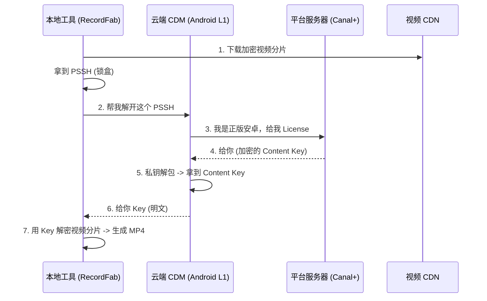

# DRM 技术机制与识别指南 (Implementation Mechanics)

本文档旨在解析流媒体数字版权管理 (DRM) 的底层机制，特别是如何识别加密类型、理解安全分级以及浏览器实现的差异。

## 零、 破冰：CDM 到底是个什么东西？

如果把整个流媒体播放看作一次**“绝密押运”**，那么 CDM (Content Decryption Module) 就是那个**“黑箱保险柜”**。

为了让你建立直观联系，我们从三个维度来拆解它：

### 1. 物理形态：它只是一个文件
别把它想得太玄乎。在你的电脑硬盘里，它就是实实在在的一个**动态链接库文件**。
*   **Chrome (Widevine):** 文件名叫 `widevinecdm.dll` (Windows) 或 `libwidevinecdm.so` (Linux)。
*   **Edge (PlayReady):** 文件名叫 `mspr.dll` (Microsoft PlayReady)。

**它和普通 DLL 的区别：**
它是**闭源**的。虽然 Chromium 是开源的，但 Google 不会把 CDM 的源代码公开。浏览器厂商必须向 Google 申请，拿到这个编译好的二进制文件，扔进浏览器安装目录里。

### 2. 核心职责：是解密 (Decryption)，不是加密 (Encryption)！
**这里有一个常见的误区。** 请看它的全称：Content **Decryption** Module。

*   **加密 (Encryption):** 发生在**服务器端**。
    *   片方（Netflix/Canal+）在视频上线前，用打包工具（Packager）把原始视频加密成乱码。这时候 CDM 还没出场。
*   **解密 (Decryption):** 发生在**你的电脑里**。
    *   你的浏览器下载了乱码视频，CDM 负责向服务器要钥匙，然后把乱码还原成图像。

**一句话总结：CDM 是用来“开锁”的，不是用来“上锁”的。**

### 3. 逻辑位置：它是“浏览器”与“操作系统”之间的翻译官
你之前学习了 CEF 和 Chrome。CDM 夹在网页(JS)和底层硬件之间。

```mermaid
graph TD
    A[网页 JavaScript] -->|1. 给我钥匙 (EME API)| B(浏览器内核 Chromium)
    B -->|2. 转发请求| C{CDM 黑盒}
    C -->|3. 生成请求| D[License Server]
    D -->|4. 返回加密钥匙| C
    C -->|5. 偷偷解密| E[视频渲染管道]
    
    style C fill:#f96,stroke:#333,stroke-width:4px
```

*   **对上 (网页):** 它通过 **EME (Encrypted Media Extensions)** 标准接口与网页对话。网页把下载到的“加密数据包”塞给它。
*   **对内 (黑盒):** 它在内部用私有算法处理数据。**这是关键：解密后的画面，CDM 不会还给网页 JS（防止你用 JS 把画面存下来），而是直接交给显卡去画。**
*   **对下 (硬件):** 如果是 L1/SL3000 级别，CDM 会直接指挥 CPU 的 TEE (安全区) 工作。

### 3. 为什么它这么重要？
*   **它是唯一的“信任锚点”：** Netflix 信任你的浏览器，不是因为信任 Chrome，而是信任 Chrome 肚子里装的那个 `widevinecdm.dll`。
*   **它是“身份证”：** 这个 DLL 里面写死了它的版本号和安全级别。服务器一检查这个 DLL 的签名，就知道你是 L1 还是 L3。

---

## 一、 核心概念：如何“看穿”视频的加密方式？


在解密下载之前，第一步是**识别 (Identification)**。你不需要复杂的逆向工程工具，通过观察浏览器行为和网络请求即可判断。

### 1. 静态识别：看 Manifest (播放列表)
流媒体通常使用 DASH (.mpd) 或 HLS (.m3u8) 协议。在这些文件中，`ContentProtection` 标签暴露了 DRM 的 System ID。

*   **DASH (.mpd):** 搜索 `<ContentProtection>` 标签下的 `schemeIdUri`。
*   **HLS (.m3u8):** 搜索 `#EXT-X-KEY` 标签下的 `KEYFORMAT`。

| DRM 系统 | 通用名称 | System ID (UUID) | 常见浏览器 |
| :--- | :--- | :--- | :--- |
| **Widevine** | Google Widevine | `edef8ba9-79d6-4ace-a3c8-27dcd51d21ed` | Chrome, Firefox, Android |
| **PlayReady** | Microsoft PlayReady | `9a04f079-9840-4286-ab92-e65be0885f95` | Edge, Windows, Xbox |
| **FairPlay** | Apple FairPlay | `94ce86fb-07ff-4f43-adb8-93ac1335cd85` | Safari, iOS, macOS |

> **实战技巧：** 如果你在 MPD 文件中同时看到 Widevine 和 PlayReady 的 UUID，说明该视频支持**多重 DRM (Multi-DRM)**。浏览器会自动选择它支持的那个。

### 2. 动态识别：看 EME 调用 (Console)
现代浏览器通过 **EME (Encrypted Media Extensions)** API 与 DRM 模块通信。打开浏览器开发者工具 (F12) -> Console，输入以下代码可以侦测当前页面支持的 DRM：

```javascript
navigator.requestMediaKeySystemAccess('com.widevine.alpha', [{
    videoCapabilities: [{ contentType: 'video/mp4; codecs="avc1.42E01E"' }]
}]).then(() => console.log("Widevine Supported"))
  .catch(() => console.log("Widevine NOT Supported"));
```

### 3. 网络识别：看 License Request (Network)
当视频开始播放时，浏览器会发送一个 POST 请求去获取解密密钥。
*   **Widevine:** 请求体通常是 Protocol Buffers (protobuf) 二进制格式。
*   **PlayReady:** 请求体通常是 XML 格式 (包含 `<SoapAction>` 等标签)。

---

## 二、 安全分级：为什么 Edge 能看 4K，Chrome 只能看 720p？

这是用户反馈的核心痛点。内容提供商 (如 Canal+, Netflix) 严格根据 DRM 的**安全级别 (Security Level)** 来下发不同画质。

### 1. Google Widevine 分级
*   **L3 (Software Security):**
    *   **机制:** 视频解密和处理都在 CPU 的软件层完成。
    *   **风险:** 容易被内存 dump 或录屏工具捕获。
    *   **限制:** 通常限制在 **720p (HD)** 或 **480p (SD)**。
    *   **环境:** Chrome (Windows/Mac/Linux), Firefox。
*   **L1 (Hardware Security):**
    *   **机制:** 视频解密在处理器的 **TEE (Trusted Execution Environment)** 中完成，视频流直接送往显示输出，不经过操作系统内存。
    *   **优势:** 极难被录制。
    *   **权限:** 允许 **1080p, 4K, HDR**。
    *   **环境:** Android TV, 经过认证的 Android 手机。

### 2. Microsoft PlayReady 分级详解 (SL = Security Level)

你猜得完全正确。PlayReady 正是使用 **SL (Security Level)** 来划分安全等级的，这与 Widevine 的 L1/L3 是对应的概念。

| 级别 | 定义 | 对应 Widevine | 技术实现 | 典型允许画质 |
| :--- | :--- | :--- | :--- | :--- |
| **SL2000** | 软件级保护 | **L3** | **Software-DRM**。解密过程和解密后的视频数据都在普通内存中。虽然代码经过了混淆，但理论上可以被调试器读取或被录屏软件捕获。 | SD (480p) <br> HD (720p) <br> 部分 1080p |
| **SL3000** | 硬件级保护 | **L1** | **Hardware-DRM**。核心特征是 **TEE (可信执行环境)** 和 **PMP (媒体保护路径)**。视频解密在硬件隔离区进行，解密后的帧直接传给显卡，**操作系统的其他软件（包括录屏软件）无法触碰视频数据**。 | **Full HD (1080p)** <br> **4K UHD** <br> **HDR** |

**为什么 Canal+ 要求 SL3000？**
因为 SL3000 的核心价值是**防录屏**和**防密钥提取**。
*   在 **SL2000 (Chrome/Edge 软件模式)** 下，你用 OBS 录屏，能录到画面。
*   在 **SL3000 (Edge 硬件模式)** 下，你用 OBS 录屏，画面通常是**黑屏**的（只有鼠标在动）。

这就是片方愿意给 SL3000 发放 4K 画质的根本原因——盗版成本极高。

### 3. 案例复盘：Canal+ 的决策逻辑
当用户使用 RecordFab (假设基于普通 Chromium) 访问 Canal+ 时：
1.  **握手:** 网站询问浏览器：“你支持什么？”
2.  **回应:** 浏览器回答：“我支持 Widevine，安全级别是 L3。”
3.  **决策:** 网站判定 L3 不安全，只返回 **720p** 的 MPD 文件。

当用户使用 Microsoft Edge 访问时：
1.  **握手:** 网站询问：“你支持什么？”
2.  **回应:** Edge 回答：“我支持 PlayReady，安全级别是 **SL3000** (硬件级)。”
3.  **决策:** 网站判定环境安全，返回 **1080p/4K** 的 MPD 文件。

---

## 五、 决策分析：坚守 CEF 意味着什么？

**现状确认：** 项目组决定继续基于 **CEF (Chromium Embedded Framework)** 进行升级，暂不迁移至 WebView2 (Edge内核)。

基于此技术约束，我们需要明确以下后果和应对策略：

### 1. “不可逾越”的画质墙
*   **事实:** Canal+ (以及 Netflix/Disney+) 的策略是：`Widevine L3 = 720p`。
*   **限制:** CEF 在 Windows 平台上，标准实现只能调用 Widevine CDM (且通常仅限于 L3 软件级别)。
*   **结论:** 只要我们还在用 CEF，且 Canal+ 不改变策略，**我们就很难合法地获取 1080p/4K 流**。

### 2. 为什么“伪装”没用？
有开发者可能会想：“修改 User-Agent 伪装成 Edge 行不行？”
*   **操作:** 将 CEF 的 UA 改为 `Mozilla/5.0 ... Edg/119.0...`。
*   **服务器行为:** Canal+ 看到是 Edge，高兴地返回了 **PlayReady** 加密的 1080p 视频流。
*   **客户端崩溃:** CEF 收到视频流，试图寻找 PlayReady 解码器。但 CEF 内部**没有** PlayReady CDM (这是微软私有的)，也没有打通 Windows Media Foundation 的硬件通路。
*   **结果:** 播放失败 (Playback Error) 或黑屏。

### 3. CEF 路径下的可能突破口 (高难度)
如果我们必须在 CEF 下实现 1080p，剩下的路非常窄：
*   **VMP (Verified Media Path) 签名:** 尝试向 Google 申请更高级别的 Widevine 签名 (非常难，通常只给浏览器厂商)。
*   **自行编译集成 PlayReady:** 修改 Chromium 源码，尝试在 CEF 中开启 `enable_playready` 编译选项，并手动桥接 Windows API。这需要极强的 C++ 底层开发能力，且维护成本极高（每次升级 CEF 都要重新适配）。

### 4. 给用户的最终答复建议
既然我们不能切换引擎，对于用户的建议，我们只能采取**“部分采纳，实话实说”**的策略：
> "我们深入研究了集成 Edge (PlayReady) 的可能性。由于 RecordFab 采用独立的 CEF 内核以保证跨平台稳定性和隐私控制，直接集成 Edge 组件存在架构冲突。我们正在优化 Widevine 通道下的流媒体兼容性，以确保 720p 的流畅播放，同时持续关注未来支持更高画质的技术路径。"

## 六、 核心复盘：加密策略与云端伪装解密

为了帮你彻底理清这个逻辑，我们把视角从“代码”拉高到“商业模式”。

### 1. 你的理解对吗？(概念校准)

> **用户观点：** "Widevine 和 PlayReady 是加密方案，厂商提供，平台根据质量分别采购使用。"

**校准后的真相：**
*   **是锁匠，不是保安：** Widevine (Google) 和 PlayReady (Microsoft) 确实是两家最大的锁匠。
*   **一把钥匙开一把锁，但门是同一个：**
    *   流媒体平台（如 Canal+）通常采用 **Multi-DRM (多重 DRM)** 策略。
    *   **重点：** 视频文件本身（.mp4/.ts）通常只加密一次（使用通用的 AES-128 算法，称为 **CENC**）。
    *   但是，为了让 Chrome 能看，平台会在视频头里放一个 **Widevine 的锁盒 (PSSH)**。
    *   为了让 Edge 能看，平台会**同时**在头里放一个 **PlayReady 的锁盒**。
    *   **就像一个保险箱装了两个锁孔：** 你有 Widevine 钥匙就能开，有 PlayReady 钥匙也能开。

*   **质量策略是“配置”出来的，不是“采购”出来的：**
    *   平台不是“采购了 1080p 的加密”。
    *   平台是在后台配置了一条**商业规则 (Business Rule)**：
        *   `IF (Client == Widevine_L3) THEN (MaxResolution = 720p)`
        *   `IF (Client == PlayReady_SL3000) THEN (MaxResolution = 4K)`

### 2. 什么是“云端伪装解密”？(CDM Emulation)

当我们做下载工具时，既然 CEF 本身拿不到 1080p 权限，有些工具会采用**“云端借刀杀人”**的策略。

*   **场景：** 你的本地 CEF 只有 L3 权限（只能下 720p）。
*   **目标：** 想要 1080p。
*   **操作流程：**
    1.  **本地诱骗：** 你的工具修改请求头，假装自己是 Edge (SL3000) 或 Android TV (L1)，向 Canal+ 请求 1080p 的视频流地址（MPD）。
    2.  **获取锁盒：** 下载下来 MPD 后，拿到了 PlayReady 的锁盒 (PSSH)。
    3.  **云端求助：** 你的工具把这个 PSSH 发送到**你的云端服务器**。
    4.  **云端解密 (关键一步):** 你的云端服务器上，运行着一个**真正的**（或者高仿真模拟的）PlayReady CDM 模块，甚至可能连接着真实的物理设备。
    5.  **骗取密钥：** 云端用这个“高贵身份”去向 Canal+ 的 License Server 申请密钥。Canal+ 以为是合法的 Edge 浏览器在播放，于是发放了密钥。
    6.  **回传密钥：** 云端把拿到的密钥 (Key) 传回给你的本地工具。
    7.  **本地解密：** 你的工具拿着密钥，解密并保存 1080p 视频。

这就是为什么有些下载器很贵（需要维护云端 CDM 农场），而且速度慢（依赖云端交互）。这也是 RecordFab 如果坚持用 CEF 但又想做 1080p 的**唯一（灰色）出路**。


## 八、 开发者实战：CEF 如何获取 Widevine“SIM 卡”？

很多开发者误以为 CEF 一下载下来就能播 Netflix，这是错的。CEF 默认是“裸机”，不支持加密视频。

### 1. 为什么不能“自带”？(版权陷阱)
Chromium 是开源的，但 Widevine CDM 是**闭源的**且受版权保护的。
*   Google 不允许任何人把 `widevinecdm.dll` 直接打包在开源代码里分发。
*   这就像你可以免费下载安卓系统源码，但里面不包含 Google Play 服务框架一样。

### 2. 正规途径：向 Google 申请 (Castlabs / Google)
如果你是一个正规浏览器厂商（比如 Brave, Opera），你需要走官方流程：
1.  **签署协议:** 与 Google 签署 Widevine Master License Agreement。
2.  **通过认证:** 提交你的浏览器二进制文件给 Google 审核。
3.  **获取分发权:** 审核通过后，Google 允许你在你的安装包里带上 `widevinecdm.dll`。

### 3. 野路子：从 Chrome 里“偷” (Sideloading)
对于个人开发者或小型工具 (如 RecordFab 开发初期)，通常走的是“侧加载”路线。

**操作步骤：**
1.  **下载 Chrome:** 在用户电脑上安装正版 Chrome。
2.  **定位文件:** 找到 Chrome 目录下的 `widevinecdm.dll` 和 `manifest.json` (就是我们刚才用命令找到的那个)。
3.  **告诉 CEF:** 在你的 CEF 程序初始化代码 (`CefInitialize`) 中，指定这个 DLL 的路径。

```c++
// C++ 伪代码示例
CefSettings settings;
// 告诉 CEF：去这个路径加载 Widevine CDM
CefString(&settings.cache_path) = "path/to/cache";
// 关键：注册 CDM
CefRegisterWidevineCdm(
    "path/to/widevinecdm.dll", 
    callback // 回调函数，告诉你加载成功没
);
```

## 九、 终极串联：从云端欺骗到本地解密的全链路

你的理解非常到位！特别是关于“云端安卓设备”和“提取 Key”的部分。为了帮你把所有知识点串成一条线，我们来做一个**显微镜级的流程拆解**。

### 1. 核心原理：CDM 是怎么解密的？(非对称 -> 对称)

CDM 内部其实在玩一个“俄罗斯套娃”的游戏。

*   **第一层（身份认证）：**
    *   **CDM (客户端)** 有一把私钥 (Device Private Key)，它是出厂时烧录在设备里（L1）或写在 DLL 里（L3）的。
    *   **Server (服务端)** 知道这个 CDM 的公钥。
*   **第二层（密钥交换）：**
    *   服务器把**“视频解密钥匙 (Content Key)”**用 CDM 的公钥包起来（加密），发给 CDM。
    *   CDM 收到后，用自己的私钥把包裹打开，拿到了里面的**Content Key**。
*   **第三层（内容解密）：**
    *   CDM 拿着这个 Content Key，去解密视频数据（AES-128）。

### 2. 你的下载工具 (如 StreamFab) 是怎么工作的？

你描述的流程完全正确。这就是所谓的 **CDM-Proxy** 或 **Remote-CDM** 架构。

#### Step 1: 侦查 (Manifest Parsing)
*   **工具行为：** 你的本地工具请求 MPD 文件。
*   **获取信息：** 拿到了 CDN 下载地址，和 PSSH (那个锁盒)。
*   **关键点：** 这时候视频分片下载下来是**看不了的**，全是乱码。

#### Step 2: 欺骗 (License Request via Cloud)
*   **工具行为：** 本地工具把 PSSH 发送给**你的云端服务器**。
*   **云端动作：**
    *   云端运行着一个真实的（或模拟的）Android L1 设备。
    *   云端伪造一个请求，把 PSSH 发给 Canal+ 的 License Server。
    *   **话术：** “你好，我是合法的 Android TV，我要播放这个视频，这是我的签名。”

#### Step 3: 提取 (Key Extraction - The Heist)
*   **服务器反应：** Canal+ 验证通过，返回了加密的 License（里面包着 Content Key）。
*   **云端动作 (最核心的一步)：**
    *   云端的 CDM 接收 License，用它的私钥打开包裹，拿到了 **Content Key**。
    *   **正常浏览器：** 会把 Key 藏在内存里，仅用于播放。
    *   **黑客工具：** 会利用漏洞或特殊环境，把这个 **Content Key (明文)** 从内存里**偷出来**。

#### Step 4: 下发与解密 (Download & Decrypt)
*   **回传：** 云端把这个明文 Key 发回给你的本地工具。
*   **本地动作：**
    *   你的工具下载加密的视频分片。
    *   你的工具使用刚才拿到的 Key (通过 ffmpeg 或 mp4decrypt)，在本地直接把视频分片解密成普通的 mp4。

### 3. 总结流程图




